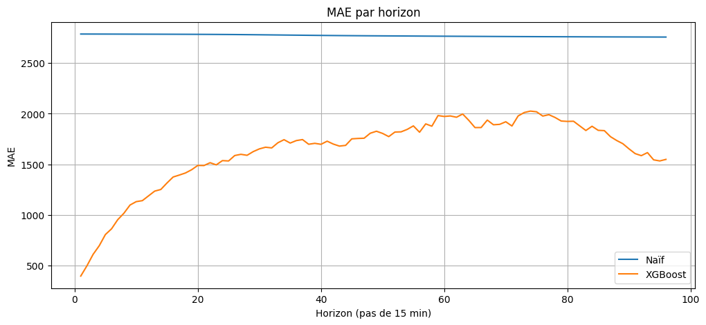
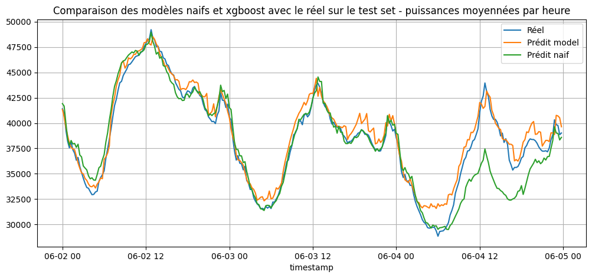

# README - RTE consumption Forecast (Time series)

## Objectif
Prédire la consommation électrique de la France sur 24 heures à partir des données publiques RTE.
Le projet utilise un modèle XGBoost pour chaque pas de 15 minutes et compare ses performances à un modèle naïf (consommation identique à la semaine précédente à la même heure).

## Données
Données RTE publiques, années 2021,2022,2023 : https://www.services-rte.com/fr/telechargez-les-donnees-publiees-par-rte.html

Le projet inclut des fonctions pour préparer et formater les fichiers RTE dans utils/data_processing.py.


## Installation

Cloner le repo et installer les dépendances :

```bash
git clone git@github.com:Tiphainell/RTE_Consumption_forecast.git
cd RTE_Consumption_forecast
python3 -m venv .venv
source .venv/bin/activate
pip install .
pip install jupyter
```

## Structure du projet

```
RTE_Consumption_forecast/
│
├─ Notebooks/           # Exploration et validation
├─ src/                 # Code source
│  ├─ train.py          # Entraînement XGBoost
│  └─ utils/            # Préprocessing et feature engineering
├─ config/              # Configurations d’entraînement (config.yaml)
├─ model/               # Modèle XGBoost sauvegardé
└─ predictions/         # Prédictions pour visualisations et validation
```

> Lancer train.py n’est pas obligatoire : les prédictions sont déjà disponibles dans predictions/.
Utile si vous voulez réentraîner le modèle avec d’autres hyperparamètres.  
 
## Méthodes

### Choix du modèle

L’analyse **exploratoire** (Notebooks/Exploration.ipynb) des données a révélé des patterns fortement saisonniers et temporels : variations jour/nuit, week-end/semaine, et saison. Ces motifs suggèrent que la consommation peut être prédite à partir de ses valeurs passées et de variables temporelles.

Pour capturer ces dépendances, nous avons choisi XGBoost, un modèle basé sur des arbres de décision, particulièrement efficace pour :

- gérer des features hétérogènes et non linéaires,
- apprendre des interactions complexes entre variables temporelles,
- s’adapter à des jeux de données volumineux tout en restant rapide à entraîner.

### Feature engineering

Le feature engineering inclut :

- des lags temporels (consommation passée à différents pas de temps),
- des features de période (heure de la journée, jour de la semaine, mois).

Le modèle a été initialement configuré avec 10 arbres et une profondeur maximale de 10 pour limiter le surapprentissage.

Pour une approche plus complète, un tuning des hyperparamètres sur un jeu de validation permettrait d’optimiser davantage les performances.

### Entrainement

Entrainement sur la période du 1er Janvier 2021 à fin avril 2023.

### Evaluation

 Le test set est composé de la série temporelle de mai 2023 à décembre 2023. Les performances de XGBoost sont comparées à celles d’un modèle naïf (prédiction identique à la consommation de la semaine précédente) en utilisant la MAE (Mean Absolute Error) :

- moyenne sur 24h,
- et dans le scénario où le modèle est réentraîné toutes les heures pour améliorer la précision sur les premiers pas.

## Résultats
Test set : mai 2023 – décembre 2023 (7 mois)

- MAE de XGBoost moyenne sur 24h : 1 632 MW (~3.6% de la consommation moyenne : 45 560 MW)
- MAE du Modèle naïf : 2 771 MW → réduction d’erreur de 40% avec XGBoost

MAE par horizon (96 pas de 15 min → 24h) :




Amélioration avec ré-entraînement horaire (les 4 premières prédictions sont utilisées) :

- MAE sur 4 premiers pas : 610 MW (~1% de la consommation moyenne)
- Réduction d’erreur de 78% par rapport au modèle naïf

Exemple sur quelques jours :



Le modèle XGBoost dépasse le modèle naïf sur certains jours (ex : 6 juin).


---


