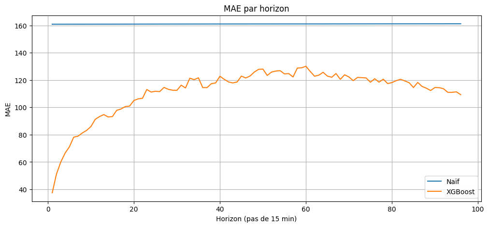
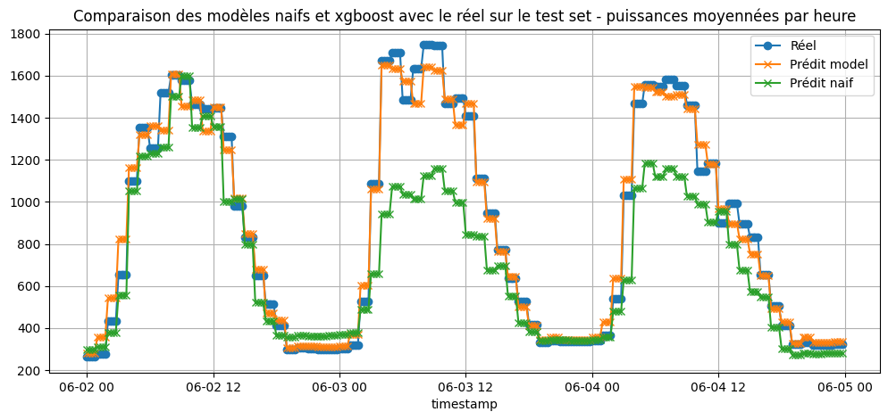

# README - Forecast Assignment

## Installation

Cloner le repo et installer les dépendances :

```bash
git clone git@github.com:Tiphainell/Storio_forecast.git
cd Storio_forecast
python3 -m venv .venv
source .venv/bin/activate
pip install .
```


## Resultat sur le test set (4 derniers mois) 

MAE en production (backtest) : 47 kW (≈ 8 % de la puissance moyenne sur la période),
contre un MAE de 161 kw pour un modèle naïf utilisant la valeur observée une semaine plus tôt (P(t) = P(t−672)).

→ Le modèle XGBoost réduit donc l’erreur d’environ 70 % par rapport à ce modèle naif.

MAE par horizon (96 horizons → 24h) :


Comparaison des prédictions en production (modèle naïf vs XGBoost vs observé) sur 3 jours :


## À lire pour comprendre le raisonnement

1. `Notebooks/Exploration.ipynb`  
   - Analyse exploratoire des données, identification des patterns saisonniers et hebdomadaires, création des features, et justification du choix du modèle.  

2. `Notebooks/Validation.ipynb`  
   - Évaluation des performances du modèle, notamment en backtest et comparaison avec un modèle naïf.

3. `Questions_partie_2/question2` : réponses à la partie 2 du homework


# Structure du projet 

## Notebooks

- **Exploration** : analyse graphique des puissances moyennes à différentes fréquences temporelles. Sert à identifier les features pertinentes et à justifier le choix de XGBoost.  
- **Validation** : évaluation quantitative et graphique du modèle sur le test set, incluant backtest et métriques (MAE globale et par horizon). 


## Dossier `src`

Code source du projet :

train.py : script d’entraînement du modèle XGBoost (paramétrable via config/config.yaml)

utils/ : fonctions utilitaires (feature engineering, preprocessing, etc.)

Le réentraînement n’est pas obligatoire : les prédictions sont déjà stockées dans predictions/.

> Remarque : Lancer `train.py` n’est pas obligatoire si vous voulez simplement consulter les résultats (stockés dans predictions), mais c’est utile pour réentraîner le modèle avec d’autres hyperparamètres.  

---

## Dossier `config`

Contient les configurations utilisées pour l'entraînement (config.yaml).

## Dossier `model`

Modèle XGBoost entraîné et sauvegardé.

## Dossier `predictions`

Matrices de prédiction utilisées pour la validation et les graphiques.


## Dossier `Questions_partie_2`
 
Réponses aux questions de la partie 2 (données additionnelles, optimisation batterie, MLOps).


